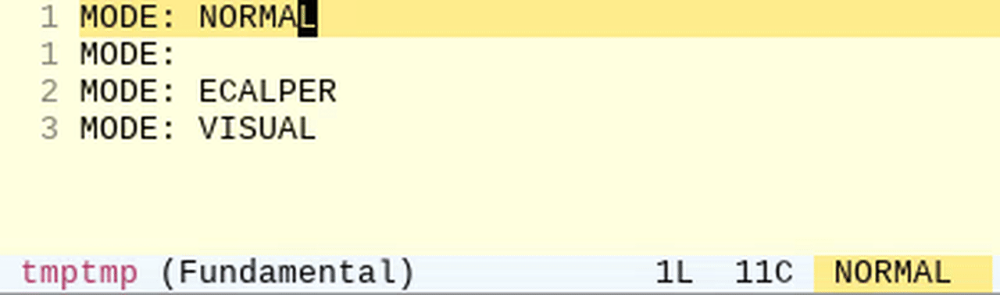

# evil-hl-line

An Emacs package that changes the `hl-line` highlight color to reflect the current [evil](https://github.com/emacs-evil/evil) mode state.

## Demo



Each evil state gets a distinct background color on the current line:

| State    | Default color      |
|----------|--------------------|
| Normal   | LightGoldenrod1    |
| Insert   | PaleGreen1         |
| Visual   | LightGray          |
| Replace  | LightPink          |
| Emacs    | LightBlue1         |
| Motion   | LightCyan          |
| Operator | sandy brown        |

## Installation

### With `use-package`

```elisp
(use-package evil-hl-line
  :after evil
  :config (evil-hl-line-mode 1))
```

### Manual

Clone the repository and add it to your load path:

```elisp
(add-to-list 'load-path "/path/to/evil-hl-line")
(require 'evil-hl-line)
(evil-hl-line-mode 1)
```
### Via MELPA

Melpa submission is planned.

## Requirements

- Emacs 27.1+
- [evil](https://github.com/emacs-evil/evil) 1.14.0+
- `hl-line-mode` or `global-hl-line-mode` enabled

## Customization

Colors are standard Emacs faces and can be customized via:

```
M-x customize-group RET evil-hl-line RET
```

Or by setting face attributes directly in your config:

```elisp
(set-face-background 'evil-hl-line-normal   "#f5deb3")
(set-face-background 'evil-hl-line-insert   "#90ee90")
(set-face-background 'evil-hl-line-visual   "#d3d3d3")
(set-face-background 'evil-hl-line-replace  "#ffb6c1")
(set-face-background 'evil-hl-line-emacs    "#add8e6")
(set-face-background 'evil-hl-line-motion   "#e0ffff")
(set-face-background 'evil-hl-line-operator "#f4a460")
```

## License

GPL-3.0-or-later. See [COPYING](COPYING) or <https://www.gnu.org/licenses/>.
